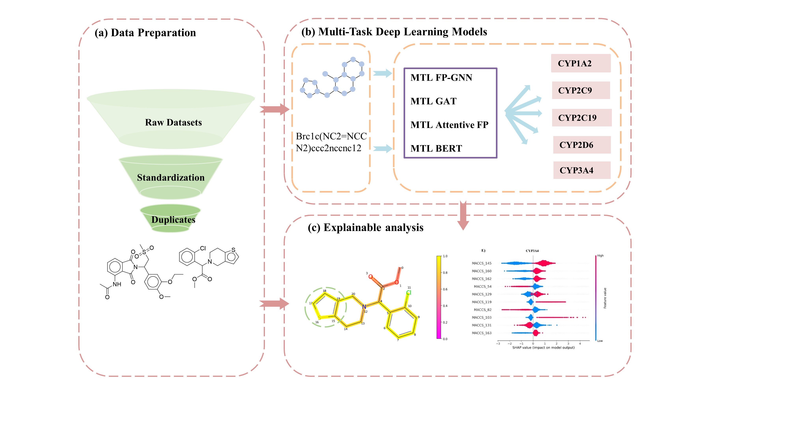

# MTL-model
Five P450s enzyme substrate prediction platform, including: CYP1A2, 2C9, 2C19, 2D6, and 3A4.


## Run Online
Now we have constructed a platform for CYP450 substrate prediction:[CypPredictor](https://lmmd.ecust.edu.cn/cyp-predictor/)

## Using local implementation
If you favor a local implementation, we've also created docker images for local deployment：
```docker pull jiaojiao334/cyp-predictor-web:latest```
```docker run -d --name=CypPredictor cyp-predictor-web:latest```

## Installation
Before you run the code, we are recommended you to create a conda environment for example:

```conda create -n MTL-model```

Then configure the relevant installation packages:

```conda env create -f environment.yaml ```

Finally activate the environment:

```conda activate MTL-model```

## Usage
The input Data file, in the format Data\MTL_data, contains a multi-tasking dataset of 10 seeds for retraining the model:

``` python train.py ```

Alternatively, you can directly enter a .csv file containing SMILES and use the trained model to get predictions:

```python external_predict.py```


